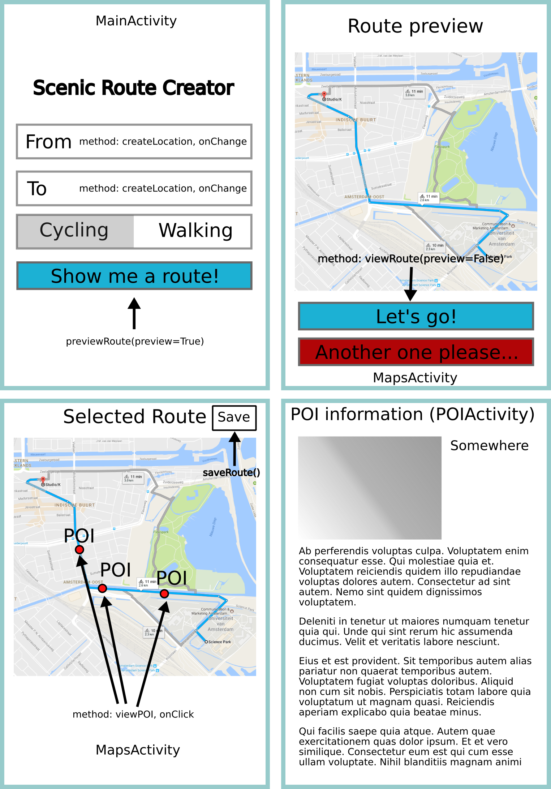

# Design document.

## Activity diagram
The activity diagram is pretty self explanatory, arrows indicate either an activity being started or a request being made to the server.
The map will be displayed using Android's own MapsActivity, with the necessary methods added.

## Class diagram
These are the base classes which are not activities. Arrows indicate the usage of that class in the attributes of other classes.
Names in parentheses are the classes which are subclassed.
A "?" describes an optional attribute. When a URI is not present, the information about the POI will be extracted from the database and html will be generated to display the POI's information.

## Screens of the app with the methods.

## Data and APIs
The data about the bridges and monuments currently resides in two turtle files which will be imported into a [Stardog](http://stardog.com/) database.
Using [dbpedia](http://dbpedia.org) I will extract more interesting places to add to the database. The query I will be using can be tested [here](http://yasgui.org/short/ryKCXamIe).
The [Flickr api photo API](https://www.flickr.com/services/api/flickr.activity.userPhotos.html) will provide places where people took pictures in Amsterdam. I will try to crossreference them with the data I already have about the monuments, as this gives a better indication whether the place where the picture was taken is really a scenic place. All of the locations from this API will be stored in the database after preprocessing.

OpenStreetMaps also contains a lot of user added POI's which I will use. Their data can be downloaded in RDF format [here](https://github.com/ucd-spatial/OsmSemanticNetwork).

The usage of all the extra data from dpedia, Flickr and OpenStreetMaps will be added in week 3, I plan to finish the MVP app in week 2 so I can focus on the data later on.

The saved routes from the users will be stored in SharedPreferences, each generated route will be stored in Stardog with a unique ID which will be added to the UserPreferences.

## Server
The code for the server can be found [here](https://github.com/RensMester/SemanticWeb). Much of it will be reused and refactored if I have the time. The server-side code will be responsible for returning JSON which contains the route that will be presented to the user.
