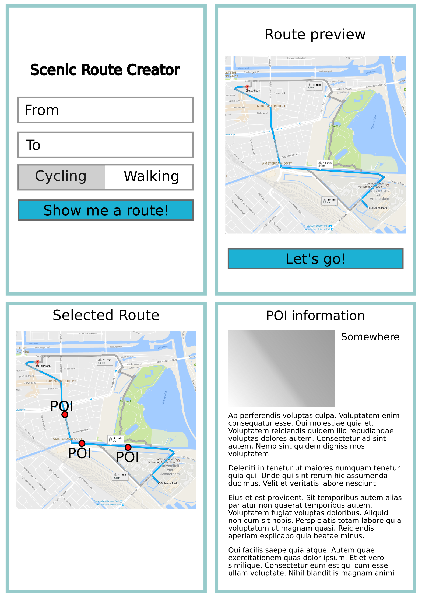

# Project proposal Scenic Route Amsterdam

## Idea

This app will create the most scenic route for a user travelling in Amsterdam. It can be used by cyclists and pedestrians. To create a scenic route, we first calculate the quickest route and check which scenic places are around this route. When a user is near a POI (point of interest) more information can be seen in the app about the POI. If a user is not content with the generated route, a new route can be generated. If a user likes a route, it can also be saved in the application.

## Data

All the monuments and bridges of Amsterdam have been gathered in a turtle file which I used in a previous assignment. I am thinking of using the Flickr API to gather at which places people take pictures, which should also be an indication that it is a scenic place. OpenStreetmaps also provides an API about buildings, waterways, etc. in Amsterdam. Wikipedia can be used for information about the POI's, these can be easily accessed by the use of Semantic Web technology. I am also thinking about using the GeoNames databases to get more POI's.

## App components

The front-end will display a screen where the user can enter a start and destination, a screen where the user will preview the route, and a screen to access saved routes. Once the route has been accepted the user will transition into screen that shows the route and the current location of the user. This screen will also show the POI's on the route on which the user can click to get more information.

The back-end for this app already exists, which I created for a Semantic Web assignment. The back-end will take the input from the user and do the route calculation. The database is stored on the back-end to make the app less data heavy. Because the app will only be based around Amsterdam I can also opt to store all the data on the device itself. This could be handy for tourists without a data-plan. Further research is necessary to determine which database I could use on the device itself. Possibly the ArcGIS geodatabase.
The route calculation is left to Google Maps, which can take waypoints from in the route. The maximum number of waypoints is 8 so this will also be the maximum within the app. When route calculation can be done in a stand-alone fashion, more points can be added to the route.

## Defining a scenic route

A scenic route will be defined as a route with a maximum of 6 POI's on the way and a length not larger than 20% of the length of the shortest route.

POI's are:
- bridges,
- points near waterways,
- museums,
- squares,
- monumental buildings,
- parks.

Preference will be for routes that go along waterways.

## Technical difficulties

Route calculation on the back-end, but this is not in the scope of this application.

## Similar applications

There are some routeplanners created specifically for motorcyclists but these are not very usefull in a city. The other route planners I could find with the query 'scenic route' did normal route planning.

## MVP

The minimum viable product should be able to generate routes for the user with a maximum of 8 POI's, due to the google maps constraint. It should be able to generate a route for the user, preview it to the user and generate a map with the route drawn onto it. The map should be able to show information about a POI when the user clicks on it.

## Screens the application will use

